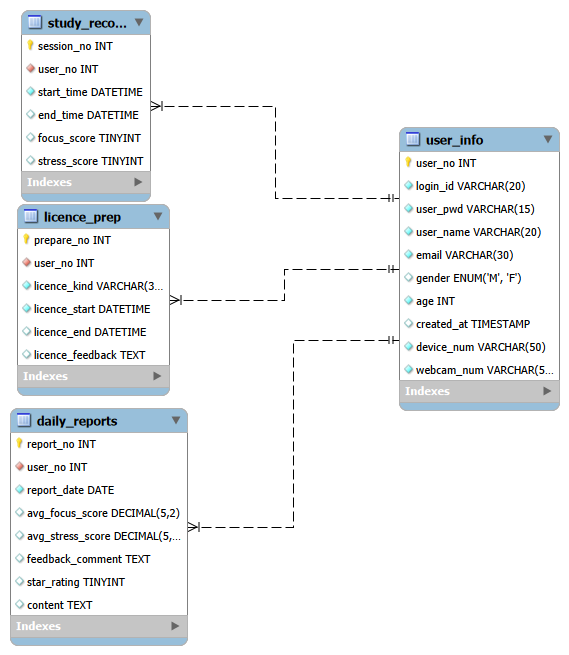

# Eye Focus Analysis

AI 기반 시선 추적을 활용한 학습 집중도 분석 시스템

---

## 📌 프로젝트 소개

MediaPipe Face Mesh를 활용하여  
눈 랜드마크 좌표를 기반으로  
집중도를 계산하는 AI 프로젝트입니다.

---

## 🛠 기술 스택

- Node.js (Express)
- Python (MediaPipe, OpenCV)
- MySQL

---

## 📊 Database ERD



---

## 🚀 실행 방법

### 1. Backend 실행

```bash
cd backend
npm install
node server.js

cd ai_server
pip install -r requirements.txt
python main.py

eye-focus-analysis/
│
├── backend/                # Node.js 서버
│   ├── server.js
│   ├── package.json
│
├── ai_server/              # Python 집중도 분석 엔진
│   ├── main.py
│   ├── requirements.txt
│
├── database/               # DB 설계 문서
│   ├── erd.png
│   └── schema.sql
│
└── README.md
```
## 🚀 주요 기능 및 특징 (Key Features)

* **실시간 시선 추적:** MediaPipe Face Mesh를 활용한 정교한 집중도 분석
* **AI 피드백:** **Google Gemini API**를 연동하여 개인별 맞춤형 학습 조언 생성
* **고성능 백엔드:** **FastAPI의 비동기 처리**를 통해 AI 응답 지연 시간 동안 서비스 블로킹 방지
* **데이터 안정성:** **Pydantic**을 통한 엄격한 데이터 검증 및 **DB 트랜잭션** 관리
```